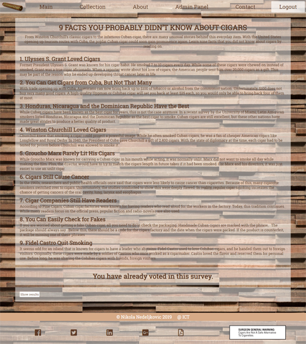

# Premium Cigars

*Sixth, responsive, website created using PHP and JavaScript and jQuery made in my second year of studying.*

## Website Desing

### *Login page*

Login implementations with PHP.

### *Register page*

Register implementations with PHP.

### *Home page*

Just some nice looking cigars, with a cigar gif.

### *Author page*

Hovering over author name will result in an area about author showing up.

### *Facts page*

Facts about cigars with voting implemented.

### *Cigars page*

Page with a lot of cigars, dinamic from SQL database. Implemented paging.

### *Admin panel page*

Admin panel with some examples of adding, deleting and edditing data.

### *Contact page*

Contact form, working with PHPMailer.